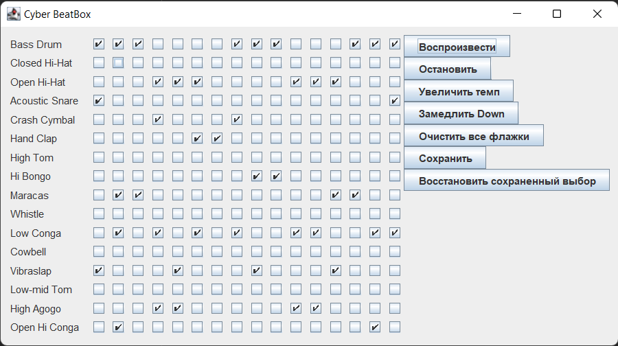

# BeatBox программа

---
## Описание проекта
  Программа создания простых звуковых композиций при помощи графического интерфейса. Выставляя флажки напротив музыкального инструмента, формируется коллекция соответствующих MIDI-событий, которые воспроизводятся в замкнутом цикле.
Данная программа была написана как закрепление прочитанной информации из книги "Изучаем Java" Кэти Сьерра и Берт Бейтс с не большими от себя изменениями.

---
### Разработчик
- [Кирилл Вохминов](https://github.com/KaerLaende)
- Кэти Сьерра и Берт Бейтс "Изучаем Java"

